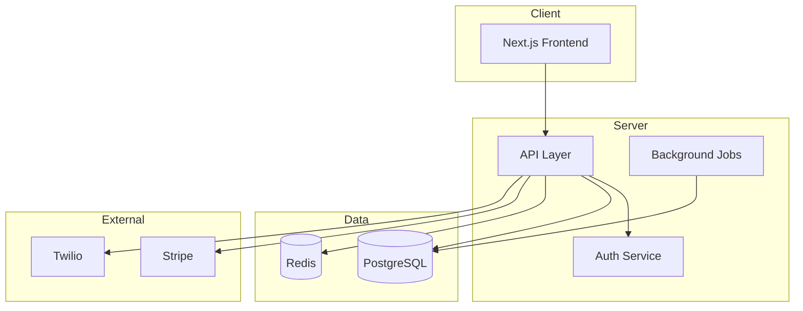

# Master Architecture Specification Template

This template generates the technical specification from a locked SOW. Every section should reference SOW feature IDs to maintain traceability.

## Template

```markdown
# Master Architecture Specification: [Project Name]
**Version:** 1
**SOW Reference:** [project-name]-sow.md
**Date:** [Date]
**Status:** DRAFT | IN REVIEW | LOCKED

---

## 1. System Architecture Overview

### 1.1 Architecture Diagram

[Generate a mermaid diagram showing high-level service boundaries, data stores, external integrations, and user-facing interfaces]



### 1.2 Technology Stack

| Layer | Technology | Version | Rationale |
|-------|-----------|---------|-----------|
| Frontend | [e.g., Next.js 14+] | [version] | [Why this choice] |
| Backend | [e.g., FastAPI / Next.js API routes] | [version] | [Why] |
| Database | [e.g., Supabase/PostgreSQL] | [version] | [Why] |
| Cache | [e.g., Redis] | [version] | [Why] |
| Auth | [e.g., Supabase Auth / NextAuth] | [version] | [Why] |
| Hosting | [e.g., Hetzner VPS / Docker] | - | [Why] |
| CDN/Storage | [e.g., Cloudflare / S3] | - | [Why] |

### 1.3 Deployment Topology

[Describe how services are deployed — single VPS with Docker Compose, Kubernetes, serverless, etc. Include SSH access, CI/CD, and environment management.]

## 2. Database Schema

### 2.1 Entity Relationship Diagram

```mermaid
erDiagram
    [Generate actual ER diagram from the data model]
```

### 2.2 Table Definitions

For each table, provide the full schema definition:

#### `[table_name]`
**Implements:** F-XXX, F-XXX

| Column | Type | Constraints | Default | Description |
|--------|------|-------------|---------|-------------|
| id | uuid | PK | gen_random_uuid() | Primary key |
| created_at | timestamptz | NOT NULL | now() | Creation timestamp |
| ... | ... | ... | ... | ... |

**Indexes:**
- `idx_[table]_[column]` on `[column]` — [Why this index exists]

**RLS Policies:** [If using Supabase/Row Level Security]

### 2.3 Migrations Strategy

[How schema changes are managed — Supabase migrations, Alembic, Prisma, raw SQL files. Include rollback approach.]

### 2.4 Seed Data

[Any initial data the system needs — admin users, configuration records, reference data]

## 3. API Design

### 3.1 API Conventions

- Base URL: [e.g., `/api/v1`]
- Auth: [Bearer token / API key / session cookie]
- Content-Type: `application/json`
- Error format: `{ "error": { "code": "string", "message": "string", "details": {} } }`
- Pagination: [cursor-based / offset]
- Rate limiting: [strategy and limits]

### 3.2 Endpoint Definitions

For each endpoint group:

#### [Resource Group] — Implements F-XXX

##### `[METHOD] /api/v1/[path]`
**Purpose:** [What this endpoint does]
**Auth:** [Required / Public / Admin-only]

**Request:**
```json
{
  "field": "type — description"
}
```

**Response (200):**
```json
{
  "field": "type — description"
}
```

**Error Responses:**
- `400` — [When/why]
- `401` — [When/why]
- `404` — [When/why]
- `429` — [When/why]

[Repeat for each endpoint]

### 3.3 Webhook Handlers

[Incoming webhooks from third-party services — Stripe, Twilio, etc. Include payload shape, verification, and processing logic.]

## 4. Component Architecture

### 4.1 Component Tree

```
app/
├── layout.tsx              — Root layout, providers, global state
├── (auth)/
│   ├── login/page.tsx
│   └── register/page.tsx
├── (dashboard)/
│   ├── layout.tsx          — Dashboard shell, nav, sidebar
│   ├── page.tsx            — Dashboard home
│   └── [feature]/
│       └── page.tsx
└── api/
    └── [route groups]
```

### 4.2 Shared Components

| Component | Props | Used By | Implements |
|-----------|-------|---------|------------|
| [ComponentName] | [key props] | [Which pages] | F-XXX |

### 4.3 State Management

[How state flows through the app — React context, Zustand, server state via React Query/SWR, URL state. Be specific about what lives where.]

### 4.4 Routing & Navigation

[Route structure, protected routes, redirects, deep linking]

## 5. Integration Requirements

For each external service:

### 5.1 [Service Name] — Implements F-XXX

- **Purpose:** [Why we integrate with this]
- **API Docs:** [URL]
- **Auth Method:** [API key / OAuth / webhook signature]
- **Data Flow:** [What data goes where, in which direction]
- **Failure Handling:** [What happens if this service is down]
- **Rate Limits:** [Service limits and how we handle them]
- **Cost:** [Per-request or monthly cost]

## 6. Build Phases

Order phases by dependency. Each phase should be independently deployable and testable.

### Phase [N]: [Phase Name]
**Dependencies:** Phase [N-1] complete
**Implements:** F-XXX, F-XXX
**Estimated Complexity:** [Simple / Moderate / Complex]

**Deliverables:**
1. [Specific technical deliverable]
2. [Another deliverable]

**Acceptance Criteria:**
- [ ] [Testable criterion]
- [ ] [Another criterion]

## 7. Security & Authentication

### 7.1 Authentication Flow
[Detailed auth flow — registration, login, session management, token refresh, logout. Include sequence diagram if complex.]

### 7.2 Authorization Model
[Role-based / attribute-based / RLS policies. Who can do what.]

### 7.3 Data Protection
- Encryption at rest: [approach]
- Encryption in transit: [TLS config]
- PII handling: [what's considered PII, how it's stored/accessed]
- Secrets management: [env vars, Vault, etc.]

### 7.4 Input Validation & Sanitization
[Where and how inputs are validated — Zod schemas, server-side validation, SQL injection prevention]

## 8. Error Handling & Observability

### 8.1 Error Taxonomy
| Error Code | HTTP Status | Meaning | User Message |
|------------|-------------|---------|--------------|
| AUTH_EXPIRED | 401 | Session expired | "Please log in again" |
| ... | ... | ... | ... |

### 8.2 Logging Strategy
[What's logged, log levels, structured logging format, where logs go]

### 8.3 Monitoring & Alerting
[Health checks, uptime monitoring, performance metrics, alert thresholds]

## 9. Testing Strategy

### 9.1 Testing Approach & Framework Selection

| Test Type | Framework | Coverage Target | Runs When |
|-----------|-----------|----------------|-----------|
| Unit Tests | [e.g., Vitest, Jest, pytest] | Core business logic, utilities, validators | Every commit / CI |
| Integration Tests | [e.g., Supertest, pytest + httpx] | API endpoints, database operations, auth flows | Every commit / CI |
| E2E Tests (Playwright) | Playwright | Critical user journeys, cross-page flows | Pre-deploy / CI |
| Visual/UX Validation | Claude in Chrome | UI rendering, responsive behavior, accessibility | Post-deploy per phase |
| API Contract Tests | [e.g., Pact, Dredd, custom] | API response shapes match spec Section 3 | Pre-deploy / CI |

### 9.2 Unit Testing Plan

Define what gets unit tested and what doesn't:

**Must unit test:**
- Input validation schemas (Zod, Yup, etc.)
- Business logic functions (pricing calculations, status transitions, permission checks)
- Utility functions (formatters, parsers, transformers)
- Database query builders / repository methods (against test database)

**Do NOT unit test:**
- Framework boilerplate (Next.js page wrappers, route definitions)
- Simple pass-through functions
- Styling / CSS

**Test organization:**
- Test files co-located with source: `[component].test.ts` or `__tests__/` directory
- Shared test fixtures in `tests/fixtures/`
- Test database seeding script in `tests/seed.ts`

### 9.3 E2E Testing Plan (Playwright)

Define the critical user journeys that get E2E test coverage:

| Journey | Steps | Assertions | Priority |
|---------|-------|------------|----------|
| [e.g., User Registration] | Navigate → fill form → submit → verify redirect + welcome | Account created in DB, session active, welcome page shown | MUST |
| [e.g., Checkout Flow] | Add to cart → enter payment → complete → verify confirmation | Order record created, Stripe charge, confirmation email triggered | MUST |
| [e.g., Admin Dashboard] | Login as admin → view metrics → export report | Data matches DB, export downloads correctly | SHOULD |

**Playwright configuration:**
- Browsers: Chromium (primary), Firefox, WebKit (secondary)
- Viewport breakpoints to test: 375px (mobile), 768px (tablet), 1440px (desktop)
- Base URL: configurable via env var for local/staging/production
- Test data: isolated per-test seeding, cleanup after each run
- Screenshot on failure: enabled
- CI integration: run on every PR, block merge on failure

### 9.4 Claude in Chrome — Visual & UX Validation

For projects with a frontend, Claude in Chrome can validate UI behavior that automated tests miss:

**Post-phase validation (manual, human-triggered):**
- After each frontend build phase, the developer uses Claude in Chrome to navigate the deployed/local app
- Claude inspects: page rendering, responsive layout, form behavior, error states, loading states, accessibility attributes
- Claude reports issues in natural language — developer triages into bug fixes or backlog

**Integration with Claude Code workflow:**
- After a build phase completes and passes Playwright E2E, the human can run Claude in Chrome against the deployed result as a "visual review" step
- This is NOT automated in the build pipeline — it's an optional human-triggered validation layer
- Particularly valuable for: first-run UX, empty state handling, mobile responsiveness, and accessibility

### 9.5 Test Data Strategy

- **Seed data:** Define standard test fixtures that create a realistic-enough dataset for all test types
- **Isolation:** Each E2E test creates its own data and cleans up — no shared mutable state between tests
- **Environment parity:** Test database uses the same schema and migrations as production
- **Sensitive data:** Never use real PII in test fixtures. Use realistic but fictional data.

## 10. Feature-to-Component Traceability Matrix

| SOW Feature | Spec Components | Database Tables | API Endpoints | UI Components | Test Coverage | Build Phase |
|-------------|----------------|-----------------|---------------|---------------|---------------|-------------|
| F-001 | [Section refs] | [Table names] | [Endpoint paths] | [Component names] | [Test types] | Phase [N] |
| F-002 | ... | ... | ... | ... | ... | ... |

Every SOW feature MUST appear in this matrix. If a feature can't be traced to specific components, the spec is incomplete. The Test Coverage column maps each feature to which test types cover it (Unit, Integration, E2E, Visual).
```

## Guidance for Spec Generation

- The spec is a *builder's document*. Write for the developer (or AI agent) who will implement it. Be precise.
- Include actual schema SQL, actual JSON shapes, actual component names. Vague descriptions like "a table for users" are insufficient — define the columns.
- Mermaid diagrams are mandatory for system architecture and database ER. They serve as visual verification that the written spec is coherent.
- If you're making a technology choice, state the rationale. This prevents revisiting decisions during build.
- The traceability matrix (Section 9) is the integrity check. Generate it last and use it to verify every SOW feature has implementation coverage.
- Version the spec explicitly. v1 is always the pre-review draft.
