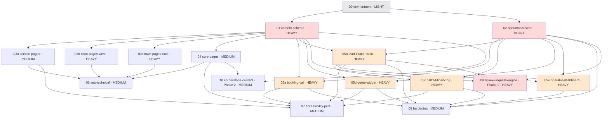

# BUILDPLAN: Suffolk County Residential Roofing Website

**Spec Version:** v3 (🔒 LOCKED 2026-08-02)
**SOW Reference:** `SOW-suffolk-roofing.md`
**Generated:** 2026-08-02
**Target Stack:** Astro (static-first) + Sanity (headless CMS) + Cloudflare (Pages/Workers, **D1** op-store, Durable Object concurrency authority, Queues, KV/R2); Twilio (SMS/Voice), Cal.com (free tier), CallRail (DNI), Acorn/Wisetack (financing), Postmark/SES (email), GA4 Measurement Protocol, Cloudflare Turnstile — spec §1.2
**Deployment Target:** Cloudflare — spec §1.3
**Operator:** Claude Code, driven by the **graph-engineer** LangGraph orchestrator (unattended). Consumes `docs/build/phases.json`.

> **Consumer note.** This build plan is executed by an unattended orchestrator, not a human pasting prompts. `docs/build/phases.json` is the machine contract; this file is the human-readable orchestration map. Phases are budgeted small: the orchestrator force-escalates any phase whose diff exceeds ~2000 changed lines to a cross-vendor adjudicator instead of promoting it, so each phase is one feature cluster / one integration / one data-model change / one page-template family.

---

## Build Sequence

**Parallelism.** After `00`: `01` and `02` run concurrently. After `01`: `03a / 03b / 03c / 04` fan out concurrently. After `02` (and `01`): `05a / 05b / 05d` fan out concurrently; `05c` and `05e` gate on `05b`. `parallelizable` in phases.json is currently informational to the orchestrator but is set honestly. HEAVY phases (pink/orange) trigger **two independent reviewer sessions**; reviewer disagreement force-escalates to a cross-vendor adjudicator rather than an ordinary fix cycle.

## Phase Summary

| Phase | Name | Intensity | Turns | Prerequisites | SOW Features | Operator File |
|-------|------|-----------|-------|---------------|--------------|---------------|
| 00 | environment | LIGHT | 25 | — | F-001 | `suffolk-roofing-phase-00-environment.md` |
| 01 | content-schema | HEAVY | 75 | 00 | F-003, F-002, F-004, F-007, F-019 | `suffolk-roofing-phase-01-content-schema.md` |
| 02 | operational-store | HEAVY | 75 | 00 | F-009, F-012, F-013, F-008, F-023 | `suffolk-roofing-phase-02-operational-store.md` |
| 03a | service-pages | MEDIUM | 50 | 00, 01 | F-004, F-018 | `suffolk-roofing-phase-03a-service-pages.md` |
| 03b | town-pages-west | HEAVY | 75 | 00, 01 | F-002, F-003, F-019 | `suffolk-roofing-phase-03b-town-pages-west.md` |
| 03c | town-pages-east | HEAVY | 75 | 00, 01 | F-002, F-003, F-019 | `suffolk-roofing-phase-03c-town-pages-east.md` |
| 04 | core-pages | MEDIUM | 50 | 00, 01 | F-005, F-022 | `suffolk-roofing-phase-04-core-pages.md` |
| 05a | booking-cal | HEAVY | 50 | 00, 01, 02 | F-008, F-015 | `suffolk-roofing-phase-05a-booking-cal.md` |
| 05b | lead-intake-twilio | HEAVY | 75 | 00, 01, 02 | F-009, F-012, F-015 | `suffolk-roofing-phase-05b-lead-intake-twilio.md` |
| 05c | callrail-financing | HEAVY | 50 | 00, 01, 02, 05b | F-010, F-011, F-015 | `suffolk-roofing-phase-05c-callrail-financing.md` |
| 05d | quote-widget | HEAVY | 50 | 00, 01, 02 | F-014 | `suffolk-roofing-phase-05d-quote-widget.md` |
| 05e | operator-dashboard | HEAVY | 50 | 00, 02, 05b | F-023 | `suffolk-roofing-phase-05e-operator-dashboard.md` |
| 06 | seo-technical | MEDIUM | 50 | 01, 03a, 03b, 03c, 04 | F-006, F-007, F-017, F-015, F-018 | `suffolk-roofing-phase-06-seo-technical.md` |
| 07 | accessibility-perf | MEDIUM | 50 | 03a, 03b, 03c, 04, 05a, 05b, 05c, 05d | F-016, F-020 | `suffolk-roofing-phase-07-accessibility-perf.md` |
| 08 | hardening | MEDIUM | 50 | 02, 05a, 05b, 05c, 05d, 05e | F-021 | `suffolk-roofing-phase-08-hardening.md` |
| 09 | review-request-engine *(Phase 2)* | HEAVY | 75 | 01, 02, 05b | F-013 | `suffolk-roofing-phase-09-review-request-engine.md` |
| 10 | cornerstone-content *(Phase 2)* | MEDIUM | 50 | 01, 04 | F-022 | `suffolk-roofing-phase-10-cornerstone-content.md` |

## Feature Traceability

Every SOW feature (F-001…F-023) appears in ≥1 phase. This table is the integrity check.

| SOW Feature | Description | Build Phase(s) | Spec Sections |
|-------------|-------------|----------------|---------------|
| F-001 | Astro static-first + Sanity headless (WP fallback) | 00 | 1.2, 1.3 |
| F-002 | 12 deep town pages `/areas/[town]/` | 01, 03b, 03c | 2.2, 4.4 |
| F-003 | Town-page required non-swappable CMS fields | 01, 03b, 03c | 2.2, 2.4 |
| F-004 | ~9 service pages | 01, 03a | 2.2, 4.4 |
| F-005 | Core site pages | 04 | 2.2, 4.4 |
| F-006 | Internal-linking model + ≤30% exact-match anchors | 06 | 4.4 |
| F-007 | Structured-data / JSON-LD by page type | 01, 06 | 2.2, 4 |
| F-008 | Booking — Cal.com free tier | 02, 05a | 2.5, 3.2 |
| F-009 | Speed-to-lead automation (Twilio) | 02, 05b | 3.1, 3.2, 5.2 |
| F-010 | DNI call tracking (CallRail) | 05c | 3.2, 5.3 |
| F-011 | Financing prequal — third-party soft-pull | 05c | 4, 5.9 |
| F-012 | 3-step lead form + TCPA consent | 02, 05b | 4, 3.2 |
| F-013 | Review-request tooling — ungated *(Phase 2)* | 02, 09 | 2.2, 3.2, 5.5 |
| F-014 | Lead-capture quote widget — non-binding *(→ Launch, SPEC-016)* | 05d | 2.4, 3.2 |
| F-015 | Analytics — GA4 + Search Console + call tracking | 05a, 05b, 05c, 06 | 1.1, 3.2 |
| F-016 | WCAG 2.2 AA + accessibility statement | 07 | 4, 9 |
| F-017 | 301 redirects + split XML sitemaps | 06 | 4.4 |
| F-018 | Storm/emergency/leak cluster + LSA before Oct 2026 | 03a, 06 | 4, 5.8 |
| F-019 | License-number display + DCA verify link | 01, 03b, 03c | 2.2, 7 |
| F-020 | Performance budget (≤4 scripts, LCP) | 07 | 4, 9 |
| F-021 | Handoff documentation | 08 (finalized), all phases | 1.3, 8 |
| F-022 | Editorial seed content + `/resources/` hub | 04, 10 | 2.2, 4.4 |
| F-023 | Operator dashboard (auth-gated) | 02, 05e | 2.5, 7.1 |

---

## Phase Details

### Phase 00: Environment
**Intensity:** LIGHT | **Turns:** 25 | **Prerequisites:** none
**Operator:** `suffolk-roofing-phase-00-environment.md` | **Review:** `suffolk-roofing-review-phase-00.md`

**Objective:** Astro scaffold, Sanity project link, D1 migration tool wired, and the **full test-command surface** stood up so the orchestrator's post-phase gate runs identically from Phase 00 onward.

**Components:** Astro project; Sanity project/dataset link; Cloudflare `wrangler.toml` + D1 binding + migrations tool; `vitest.config` + one passing unit test; `playwright.config` + one passing placeholder spec; `package.json` scripts (`build`, `typecheck`, `lint`, `test:*`); `.env.example` / Doppler references.

**Acceptance (this is the orchestrator gate, run after every phase):**
- `npm run typecheck` exits 0
- `npm run lint` exits 0
- `npx vitest run --coverage --reporter=json --outputFile=.vitest.json` exits 0
- `npx playwright test --reporter=json` exits 0
- **Dependencies already installed — the prompt states explicitly: do NOT run `npm install`.**

**Spec:** 1.2, 1.3, 5.2, 5.3, 5.7, 5.8, 6. **Rollback:** delete scaffold, re-run; no persistent state.

### Phase 01: Content Schema (HEAVY)
**Turns:** 75 | **Prereq:** 00 | Sanity schema: `town / service / townPricing / job / review / faq / post / siteSettings`.
**Dangerous parts:** required-field **publish gate** — a `job` document MUST carry resolvable customer contact (prior CRITICAL); `town.historicOverlay` modeled so a no-overlay town can still publish (§2.2); §771-B banned-phrase content lint wired into the build (§7.5). **Spec:** 2.2, 2.4, 4.4, 7.5. **Rollback:** revert schema, redeploy dataset (seed only).

### Phase 02: Operational Store (HEAVY)
**Turns:** 75 | **Prereq:** 00 | D1 schema in **SQLite-native types** + migrations tool + backup/restore drill.
**Dangerous parts:** all timestamps **integer epoch-ms**, ids `TEXT`, booleans `INTEGER 0/1`, enums `TEXT + CHECK` — **no `timestamptz`/`uuid`** (prior CRITICAL). Tables: `lead, consent_record, booking, suppression, message_log, webhook_events, operator_access_log, review_request` + indexes (§2.5). `opt_out`/`suppression` + `consent_record` get near-zero-RPO durability (§1.3). **Spec:** 1.2, 1.3, 2.5, 8. **Rollback:** `wrangler d1 migrations` down; re-migrate (seed only).

### Phases 03a / 03b / 03c / 04: Pages
**03a** service-pages (MEDIUM, 50) — 9 services + hub + emergency-cluster UX (click-to-call hero, no time-bound promise). **03b/03c** town-pages (HEAVY, 75 each) — 12 launch towns split into two batches; content-heavy, each approaches the diff ceiling alone; every required field populated from primary sources. **03c** additionally renders East-End **informational-only** (no-CTA) content and exercises the deterministic ZIP→town gate fail-safe. **04** core-pages (MEDIUM, 50) — home/about/contact/reviews/warranties/gallery/financing/`/resources/` hub with seed editorial. **Rollback:** git revert to phase tag; content-only, no schema impact.

### Phases 05a–05e: Conversion Stack (all HEAVY)
- **05a booking-cal** (50) — Cal.com embed + `/api/webhooks/calcom` (idempotent, key = uid + trigger) + `booking` upsert + walk-up `lead` creation + **single** server-side GA4 `booking_completed` via Measurement Protocol with the real `client_id`.
- **05b lead-intake-twilio** (75) — 3-step `LeadForm` (native-POST fallback) + `/api/lead` + **Durable Object** concurrency authority (per-phone 24h window + suppression + budget reservation) + **Queue-worker async SMS dispatch** + `/api/webhooks/twilio` (status `MessageSid:MessageStatus`, STOP/START) + `consent_record` snapshot + `slo-sweep` cron + NANP restriction + per-phone daily cap.
- **05c callrail-financing** (50) — CallRail DNI (canonical NAP preserved) + missed-call text-back (reuses 05b send path) + Acorn/Wisetack financing facade + **resolve inbound-number ownership** CallRail vs Twilio (HIGH finding, §3.2/§5.3).
- **05d quote-widget** (50) — `QuoteWidget` + `/api/quote` (reads materialized blob; gated towns get no-price informational payload) + **`/api/webhooks/sanity-publish`** blob materialization + network-error state.
- **05e operator-dashboard** (50) — F-023: Cloudflare Access/OIDC + MFA; server-only op-store reads writing `operator_access_log`; emailed resend link = authenticated **POST with single-use short-TTL signed token** (no GET side effects).

**Rollback:** each is feature-flag / env-var disable-able; git revert to phase tag; migrations reversible.

### Phase 06: SEO-Technical (MEDIUM, 50)
JSON-LD by page type (`RoofingContractor/Service/FAQPage/BreadcrumbList/Review`); split XML sitemaps; 301 redirect discipline; internal-linking + ≤30% exact-match anchor-ratio CI check; storm cluster indexed. **Spec:** 2.2, 4.4.

### Phase 07: Accessibility-Perf (MEDIUM, 50)
WCAG 2.2 AA incl. Target Size 2.5.8, Focus Appearance, focus-not-obscured, redundant-entry; `/accessibility` statement page (launch gate); performance-budget CI gate (LCP ≤200KB hero, explicit w/h, **≤4 async third-party scripts**). **Spec:** 4, 4.4, 9.

### Phase 08: Hardening (MEDIUM, 50)
CSP report-only → enforce (§7.3); rate-limit hardening; webhook idempotency ledger retention/prune; retention/purge for `webhook_events`/`message_log`/`review_request.customer_contact`/Sanity `job` PII; backup/restore verification; F-021 handoff-doc checklist finalized. **Spec:** 1.3, 2.5, 3.3, 7, 8.

### Phase 09 (Phase 2): Review-Request Engine (HEAVY, 75)
F-013 — `/api/webhooks/sanity-job` + `review_request` + cron + templated email (List-Unsubscribe) / SMS, **identical ungated ask** to 100% of customers. Naturally gated: no completed jobs exist at launch. This is where the CRITICAL job-contact-field bug lived — **HEAVY, dual-reviewer.** **Spec:** 2.2, 2.5, 3.2, 5.5, 7.

### Phase 10 (Phase 2): Cornerstone Content (MEDIUM, 50)
F-022 — cornerstone editorial per §2.2/§4.4, blog↔money-page internal links.

---

## Execution Guidance — graph-engineer Orchestration

- **Builder tool allowlist (do not assume anything outside it):** `Edit, Write, Read, Glob, Grep, Bash(npm run build), Bash(npm run typecheck), Bash(npm run lint), Bash(npm run test:*), Bash(npx vitest:*), Bash(npx playwright:*), Bash(git status:*), Bash(git diff:*), Bash(git add:*), Bash(git commit:*), mcp__supabase, mcp__playwright, mcp__filesystem`. **No `npm install`/`npm ci`** (deps installed once, manually, pre-run). **No `git push`** (orchestrator owns commits). No arbitrary npm/npx scripts outside build/typecheck/lint/test:*.
- **Post-phase gate** (identical every phase, from 00): the four commands in Phase 00 acceptance must all exit 0.
- **Review cycle:** verdict JSON is read literally — `verdict` ∈ PROMOTE/FIX/ESCALATE; `acceptance_criteria` summed into the commit message; `issues_found` fed to the orchestrator's built-in fixer. HEAVY phases get two independent reviewers; disagreement → cross-vendor adjudicator.
- **Session isolation:** one fresh session per phase; `PHASE-NN-PROGRESS.md` handshake for `--continue` resumption.

## Risk Register

| Risk (carried from spec review) | Phase | Mitigation in build plan |
|---|---|---|
| Synchronous SMS blocking `/api/lead` (prior CRITICAL) | 05b | DO + Queue async dispatch; acceptance test stalls outbound SMS and asserts 201 not blocked |
| Op-store Postgres types on SQLite target (prior CRITICAL) | 02 | SQLite-native DDL acceptance check (no `timestamptz`/`uuid`) |
| Webhook non-idempotency (prior CRITICAL) | 05a, 05b, 09 | `webhook_events` ledger + composite idempotency keys per webhook |
| SMS rate-limit not per-phone / not NANP (prior CRITICAL) | 05b | DO per-phone 24h serialization + NANP at Zod & Twilio; per-phone daily cap acceptance test |
| `job` doc missing customer contact (prior CRITICAL) | 01, 09 | required-field publish gate; dual-reviewer on 09 |
| CallRail vs Twilio inbound-number ownership (HIGH) | 05c | Phase resolves ownership before wiring text-back; ANI-passthrough Phase-0 gate |
| Phase diff > ~2000 lines → auto-escalation | 03b/03c | towns split across two phases to stay under ceiling |
| Solo-founder capacity vs Oct deadline (SOW §12) | 03a, 06 | storm cluster + LSA (03a/06) is the non-negotiable minimum slice; everything else can slip |

## Rollback Strategy

| Phase | Rollback | Data Impact |
|-------|----------|-------------|
| 00 | Delete scaffold, re-run | None |
| 01 | Revert schema, redeploy dataset | Seed only |
| 02 | `d1 migrations` down, re-migrate | Seed only (migrations reversible) |
| 03a–04 | Git revert to phase tag | None (content) |
| 05a–05e | Feature-flag/env disable; git revert to tag | Preserve lead/consent data; migrations reversible |
| 06–08 | Git revert to phase tag | None (config/hardening) |
| 09–10 | Feature-flag disable; git revert | Preserve `review_request` data |

---

## Pre-Flight (before the orchestrator's first run — not build-prompter's job)

1. `git init` + initial commit of the scaffold (repo does not yet exist).
2. Install all dependencies once, manually; commit `package-lock.json`.
3. Confirm `package.json` defines `build`, `typecheck`, `lint`, `test:*` matching Phase 00.
4. Doppler dev config with the vendor keys the build actually needs (Sanity, Cloudflare, Twilio, Cal.com, CallRail, GA4, Postmark/SES).
5. `--dry-run --phases 00` against the orchestrator before any full autonomous run (per its rollout ladder — do not start at a full night).
