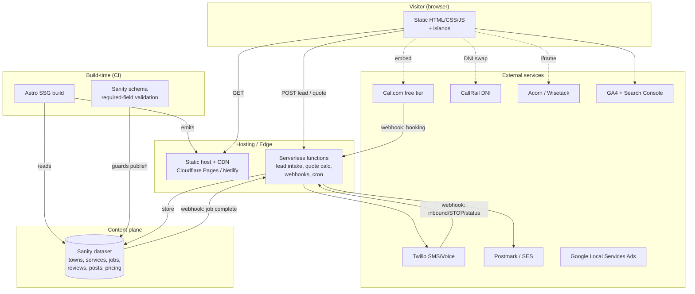
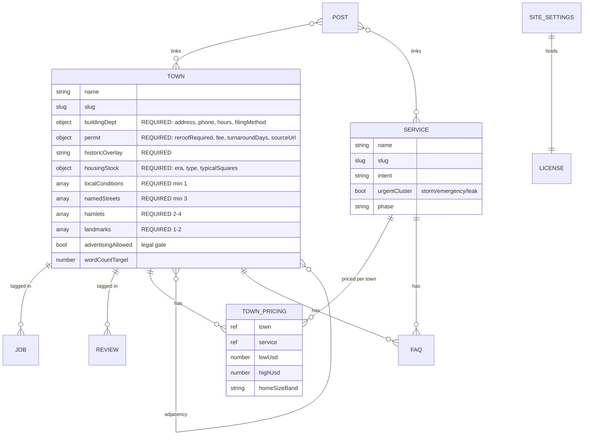

# Master Architecture Specification: Suffolk County Residential Roofing Website

**Version:** 1
**SOW Reference:** `SOW-suffolk-roofing.md`
**Research Reference:** `SYNTHESIS-suffolk-roofing.md`
**Date:** 2026-08-02
**Status:** DRAFT

---

## 0. Feature ID Registry (minted from the SOW)

The SOW does not use `F-XXX` identifiers. The following IDs are minted here from the SOW's In-Scope list (§2), Conversion Stack (§6), Deliverables (§7), and Technical Constraints (§8). Every ID traces back to the SOW section shown. These IDs are the spine of the Traceability Matrix (§10).

| ID | Feature | SOW Source |
|----|---------|-----------|
| F-001 | Astro static-first + Sanity headless CMS build (WordPress lean-theme as named fallback) | §2, §8 |
| F-002 | 12 deep town pages at flat `/areas/[town]/` | §2, §5 |
| F-003 | Town-page content-depth enforcement via required, non-swappable CMS schema fields | §4, §8 |
| F-004 | ~9 service pages (replacement, repair, emergency, storm, leak, flat, metal, inspection, hub) | §2, §5 |
| F-005 | Core site pages (home, financing, reviews, warranties, about, gallery, contact, resources) | §2, §5 |
| F-006 | Internal-linking model (town↔service, adjacency clusters, blog↔money, breadcrumbs, ≤30% exact-match anchors) | §5 |
| F-007 | Structured-data / JSON-LD plan by page type | §2, §8 |
| F-008 | Booking — Cal.com free-tier "Book a Free Inspection" embed | §6 |
| F-009 | Speed-to-lead automation on Twilio (missed-call / form-submit → SMS ≤5 min, retry/alert, STOP/TCPA) | §6, §7 |
| F-010 | DNI call tracking (CallRail) preserving canonical NAP | §6, §8 |
| F-011 | Financing prequal — maintained third-party soft-pull (Acorn Finance / Wisetack) | §6 |
| F-012 | 3-step lead form (ZIP → service → contact) with single TCPA consent | §6 |
| F-013 | Review-request tooling — in-house cron/webhook, email+SMS, ungated to 100% of customers | §6, §7 |
| F-014 | Lead-capture quote widget — in-house, non-binding estimate from town pricing data | §6, §7 |
| F-015 | Analytics — GA4 + Search Console + call tracking wired to key events | §2 |
| F-016 | WCAG 2.2 AA compliance (automated + one manual pass) + published accessibility statement | §2, §7 |
| F-017 | 301 redirect discipline + split XML sitemaps by content type | §2, §8 |
| F-018 | Storm/emergency/leak cluster + LSA enrollment live before October 2026 (hard deadline) | §2, §10 |
| F-019 | License-number display (footer site-wide + in-body town/service) + Suffolk DCA verify link | §7, §8 |
| F-020 | Performance budget (LCP hero ≤200KB, explicit img dimensions, ≤3–4 async scripts, AVIF/WebP, self-hosted fonts) | §7, §8 |
| F-021 | Handoff documentation sufficient for a second developer to service the site | §8 |
| F-022 | Editorial-calendar seed content + `/resources/` hub | §2, §5 |

---

## 1. System Architecture Overview

### 1.1 Architecture Diagram



### 1.2 Technology Stack

| Layer | Technology | Version | Rationale |
|-------|-----------|---------|-----------|
| Static site generator | Astro | 4.x+ | Static-first, island hydration; image-heavy 20→100+ page site is the SSG sweet spot; beats the field's plugin-bloated WordPress on speed without heroics [Synthesis 3.7]. F-001, F-020 |
| Content / CMS | Sanity (hosted) | v3 Studio | Structured editing for non-technical authors; **required-field schema** makes name-swap town pages structurally impossible; portable dataset (lock-in asymmetry favors it over an Elementor-entangled WP DB) [Synthesis 3.6, 3.7]. F-003 |
| UI islands | Astro components + minimal JS (Preact/vanilla) | — | Keep hydration surface tiny to hold the performance budget; interactive bits (lead form, quote widget) are islands, not a full SPA. F-012, F-014, F-020 |
| Serverless functions | Host-native functions (Cloudflare Workers / Netlify Functions) | — | Lead intake, quote calc, Twilio/Cal.com/Sanity webhooks, and the review-request cron. No always-on server to maintain solo. F-009, F-013, F-014 |
| Booking | Cal.com | Free tier | $0/mo single-business calendar; API/GBP-addressable so it survives future agentic booking [SOW §6, §8]. F-008 |
| Messaging | Twilio Programmable SMS + Voice | — | Usage-based speed-to-lead; owns retry/opt-out logic a SaaS would ship. F-009 |
| Call tracking | CallRail | — | DNI + multi-source attribution is a maintained product, not a good in-house build [SOW §6]. F-010 |
| Financing | Acorn Finance or Wisetack | — | Maintained third-party soft-pull; avoids the "financing page 404s" failure mode [Synthesis 3.9]. F-011 |
| Transactional email | Postmark (or Amazon SES) | — | Fractions of a cent per send for review requests + lead notifications; Postmark preferred for deliverability + simpler DX. F-013 |
| Hosting / CDN | Cloudflare Pages (primary) or Netlify | — | Free/cheap static hosting + edge functions + HSTS; keeps ongoing infra <$200/yr [Synthesis 6]. F-020 |
| Analytics | GA4 + Google Search Console | — | Key-event tracking (booking, form submit, tracked call); split sitemaps segment organic by page type. F-015, F-017 |
| **Fallback stack** | WordPress lean custom theme + Rank Math (no page builder) | — | Named fallback if developer-dependency tolerance is genuinely low [SOW §2; Synthesis CL-13]. Not built unless invoked. |

### 1.3 Deployment Topology

- **Single-repo monorepo:** `/site` (Astro), `/studio` (Sanity Studio), `/functions` (serverless handlers), `/docs` (handoff — F-021).
- **Content plane is decoupled:** Sanity is hosted SaaS; content edits trigger a **deploy webhook** → CI rebuild → CDN publish. No content edit touches code.
- **CI/CD:** Git push to `main` → CI runs (typecheck, unit tests, Playwright E2E on preview URL, **axe accessibility scan**, **performance-budget gate**) → deploy to CDN. A failing budget or axe-critical **blocks deploy** (enforces F-016, F-020).
- **Environments:** `production` (live domain), `preview` (per-PR deploy URL for E2E + visual review), `studio` (Sanity Studio at a subdomain, access-controlled).
- **Secrets:** Twilio/CallRail/Postmark/Cal.com/Sanity tokens live in host environment variables (Cloudflare/Netlify encrypted env), never in the repo. See §7.3.
- **Solo-operator note (SOW §12 risk):** the entire stack is chosen to minimize always-on surface — no database server, no VM to patch. The only custom always-running logic is the serverless functions + one scheduled cron.

---

## 2. Content Model (Sanity Schema)

> This is a content-driven marketing site, not a transactional app. The "database" is the Sanity dataset plus a small lead/event store. §2 defines the Sanity content model (the heart of F-002/F-003); §2.5 defines the lightweight operational store for leads and review-request state.

### 2.1 Content Relationship Diagram



### 2.2 Sanity Document Types

For every town document, the required fields below are enforced by a **custom Sanity validation rule** (`Rule.required()` + a document-level `validation` that blocks `publish` when any is empty). This is the technical mechanism behind SOW §4 ("a town page cannot publish with any field empty") and F-003.

#### `town`
**Implements:** F-002, F-003, F-019

| Field | Type | Required | Notes |
|-------|------|----------|-------|
| `name` | string | ✓ | e.g. "Huntington" |
| `slug` | slug | ✓ | drives `/areas/[slug]/` |
| `buildingDept` | object | ✓ | `{ streetAddress, phone, counterHours, filingMethod ('efile'|'in-person'|'both'), sourceUrl (.gov) }` |
| `permit` | object | ✓ | `{ reroofRequired (bool), feeUsd, turnaroundBusinessDays, sourceUrl (fee schedule / eCode360) }` |
| `historicOverlay` | string | ✓ | named historic-district/overlay trigger for roof work |
| `housingStock` | object | ✓ | `{ era, type, typicalRoofSquares }` |
| `localConditions` | array<string> | ✓ (min 1) | salt air / wind / flood zone / tree canopy / HOA |
| `namedStreets` | array<string> | ✓ (min 3) | real streets |
| `hamlets` | array<string> | ✓ (2–4) | neighborhoods/hamlets |
| `landmarks` | array<string> | ✓ (1–2) | |
| `pricing` | array<ref `townPricing`> | ✓ | price range by service × home-size band |
| `taggedJobs` | array<ref `job`> | ✓ (min 3) | 3–5 town-tagged recent jobs |
| `townReviews` | array<ref `review`> | — | ≥1 where available |
| `faqs` | array<ref `faq`> | ✓ (10–13) | search-voice FAQ, feeds `FAQPage` schema |
| `bodyLicenseNumber` | string (computed from `siteSettings`) | ✓ | in-body license presence check (F-019) |
| `adjacentTowns` | array<ref `town`> | ✓ (2–4) | geographically adjacent only (F-006) |
| `advertisingAllowed` | bool | ✓ | **false** for Southampton/East Hampton/Shelter Island — gates "we serve you" CTAs (legal gate, §7.2 authorization) |
| `bodyContent` | portable text | ✓ | target 2,500–4,000 words; density is the real bar |

**Publish gate:** a document-level validation aggregates all required fields; Studio shows a blocking error and the "Publish" action is disabled until satisfied. Word-count target is a *soft* warning, not a hard block (density > count per SOW §4).

#### `service`
**Implements:** F-004, F-018

`{ name, slug, intent, urgentCluster (bool — true for emergency/storm/leak), offersPrice (bool — gates Service.offers schema), phase ('launch'|'phase2'), bodyContent }`

#### `townPricing`
**Implements:** F-014 (feeds the quote widget), F-002

`{ town (ref), service (ref), homeSizeBand ('small'|'medium'|'large'), lowUsd, highUsd, effectiveYear }` — the quote widget (F-014) reads *only* from these records; it must never hardcode a number (SOW §7 acceptance test).

#### `job`
`{ title, town (ref), service (ref), completedDate, photos (array<image>), summary, status ('scheduled'|'in-progress'|'completed') }` — `status → completed` is the trigger for the review-request cron (F-013).

#### `review`
**Implements:** F-007

`{ authorName, rating, body, town (ref), source ('google'|'other'), sourceUrl, verifiedFeed (bool) }` — `Review`/`AggregateRating` schema emits **only** where `verifiedFeed = true` (SOW §8: "only from a real, auditable feed").

#### `faq`
`{ question, answer, town (ref, optional), service (ref, optional) }` — feeds `FAQPage` JSON-LD (F-007).

#### `post` (blog/guide)
**Implements:** F-022, F-006

`{ title, slug, body, publishedAt, linkedServices (array<ref>, min 1), linkedTowns (array<ref>) }` — validation requires ≥1 in-body money-page link (F-006).

#### `siteSettings` (singleton)
**Implements:** F-019, F-007

`{ licenseNumber, licenseVerifyUrl (Suffolk DCA lookup), legalBusinessName, canonicalNAP {name,address,phone}, insurance {glLimit, wcOnFile}, socialSameAs[] }` — the license number and canonical NAP render into the footer template site-wide and into JSON-LD.

### 2.3 Content Validation & Publish Strategy

- Required-field enforcement lives in Sanity schema validation (client) **and** is re-checked in the build (CI) — a build fails if any *published* town lacks a required field, so a schema bypass can't ship a thin page.
- **Migrations:** schema changes are versioned in `/studio/schemas` (code). Sanity content migrations use `@sanity/migrate` scripts committed to the repo; each has a documented rollback (re-run prior migration).

### 2.4 Seed Data

- `siteSettings` singleton (license #, NAP, verify URL, insurance).
- 12 `town` stubs (names + slugs) for the launch set; Phase-1 populates 5–6 fully.
- `service` records for the ~9 launch services (`urgentCluster=true` on emergency/storm/leak).
- Seed `post` records per the editorial calendar (F-022).

### 2.5 Operational Store (leads & review-request state)

Not all data belongs in Sanity. Lead submissions, quote-widget submissions, message-delivery state, and review-request tracking need a small write-heavy store queried by the serverless functions. Use the **host's KV/D1 (Cloudflare) or a lightweight Postgres (Supabase free tier)** — decision below.

#### `lead`
**Implements:** F-012, F-009

| Column | Type | Notes |
|--------|------|-------|
| id | uuid PK | |
| created_at | timestamptz | |
| zip / service / name / phone / email | text | from 3-step form |
| tcpa_consent | bool | single PEWC checkbox; store consent text + timestamp |
| source | text | form / missed-call / quote-widget |
| speed_to_lead_sms_sent_at | timestamptz | for the ≤5-min acceptance test (F-009) |
| status | text | new / contacted / booked |

#### `message_log`
**Implements:** F-009, F-013

`{ id, lead_id, channel (sms|email), template, provider_message_id, status (queued|sent|delivered|failed), retry_count, opted_out (bool), created_at }` — powers retry/alert and STOP suppression.

#### `review_request`
**Implements:** F-013

`{ id, job_id, customer_contact, requested_at, channel, responded (bool) }` — dedupe so one completed job triggers exactly one ask; drives the "who's been asked/who responded" dashboard.

#### `opt_out`
**Implements:** F-009 (TCPA)

`{ phone PK, opted_out_at }` — every outbound SMS checks this table first; inbound `STOP` webhook writes here.

**Store decision:** default to **Cloudflare D1 (SQLite)** if hosting on Cloudflare Pages (co-located, zero extra vendor, free tier ample at launch volume). If hosting on Netlify, use **Supabase free-tier Postgres**. Either way the schema above is unchanged. Flag for §8 review: this is the one net-new datastore the solo build must own.

---

## 3. API & Function Design

### 3.1 Conventions

- Functions are host-native serverless endpoints under `/api/*` on the same origin (no CORS, no separate API host).
- Content-Type `application/json`; error shape `{ "error": { "code": "string", "message": "string" } }`.
- All inbound webhooks verify provider signatures (Twilio signature, Cal.com secret, Sanity webhook secret) before processing.
- Rate limiting: per-IP token bucket on public POST endpoints (lead, quote) at the edge — 10 req/min/IP — to blunt spam/abuse of the SMS-triggering path (cost + TCPA risk).

### 3.2 Endpoints

#### Lead intake — Implements F-012, F-009

##### `POST /api/lead`
**Purpose:** accept the 3-step form; persist lead; fire speed-to-lead SMS.
**Auth:** Public (rate-limited + Turnstile/hCaptcha token to stop bots triggering paid SMS).

**Request:**
```json
{
  "zip": "string",
  "service": "string (service slug)",
  "name": "string",
  "phone": "string E.164",
  "email": "string?",
  "tcpaConsent": "bool — must be true",
  "captchaToken": "string"
}
```
**Response (201):** `{ "leadId": "uuid", "message": "We'll text you right back." }`
**Errors:** `400` missing/invalid field or `tcpaConsent=false`; `429` rate-limited; `403` captcha failed.
**Side effects:** insert `lead`; if `phone` not in `opt_out`, enqueue speed-to-lead SMS via `/internal/send-sms`; record `speed_to_lead_sms_sent_at`. SMS target: within 5 minutes (acceptance test, F-009) — fire synchronously on submit, so latency is seconds not minutes.

#### Quote widget — Implements F-014

##### `POST /api/quote`
**Purpose:** compute a **non-binding** estimate range from town + service + rough size.
**Auth:** Public (rate-limited).

**Request:** `{ "townSlug": "string", "service": "string", "homeSizeBand": "small|medium|large" }`
**Response (200):**
```json
{
  "lowUsd": 0,
  "highUsd": 0,
  "disclaimer": "Non-binding estimate. Final price confirmed after a free inspection.",
  "source": "town-pricing"
}
```
**Rules:** the range is read from the `townPricing` records (§2.2) via the CDN-cached content API — **never a hardcoded number** (SOW §7 acceptance test). If no pricing record exists for the town×service×band, return `422 { error: pricing_unavailable }` and the UI shows "Book an inspection for a precise quote" rather than inventing a number.

#### Cal.com booking webhook — Implements F-008, F-015

##### `POST /api/webhooks/calcom`
**Purpose:** receive `BOOKING_CREATED`; fire the GA4 key event server-side (Measurement Protocol) and notify the operator.
**Auth:** Cal.com webhook secret (HMAC verify).
**Processing:** verify → mark related lead `status=booked` if matchable by phone/email → send GA4 `booking_completed` event → email/SMS the operator.

#### Twilio inbound / status webhook — Implements F-009

##### `POST /api/webhooks/twilio`
**Purpose:** handle inbound SMS (including `STOP`/`START`), delivery-status callbacks.
**Auth:** Twilio signature validation.
**Processing:** `STOP`/`UNSUBSCRIBE`/`CANCEL` → upsert `opt_out`, suppress future sends (acceptance test: send STOP → confirm no further messages). Delivery `failed` → increment `retry_count`; after N retries → alert operator (acceptance test: simulate failed send → confirm alert/retry fires).

#### Missed-call handler — Implements F-009

##### `POST /api/webhooks/twilio-voice`
**Purpose:** on a missed/unanswered inbound call, auto-fire the text-back SMS within the acceptance window.
**Processing:** TwiML/status callback detects no-answer → if caller not opted out → send templated "Sorry we missed you — how can we help?" SMS → log to `message_log`.

#### Sanity job-complete webhook (review request) — Implements F-013

##### `POST /api/webhooks/sanity-job`
**Purpose:** when a `job.status` transitions to `completed`, trigger the review-request send.
**Auth:** Sanity webhook secret.
**Processing:** verify → dedupe against `review_request` (one ask per job) → send identical templated email (Postmark) **and/or** SMS (Twilio) to the customer, with **no satisfaction pre-filter** (acceptance test: same trigger fires regardless of any satisfaction field — Google review-gating ban, §7). Write `review_request`.

#### Review-request cron — Implements F-013

##### Scheduled function `cron: review-sweep` (hourly)
**Purpose:** backstop the webhook — catch jobs marked complete while the webhook was down; send any review request queued but not yet sent; respect a defined send window.

#### CallRail — Implements F-010
DNI is a client-side script swap (CallRail JS) + server has no custom endpoint. Canonical NAP stays fixed in HTML/JSON-LD; only the displayed number swaps (no NAP risk, SOW §8).

### 3.3 Webhook Verification Summary

| Webhook | Verification | Failure action |
|---------|--------------|----------------|
| `/api/webhooks/calcom` | HMAC secret | 401, log |
| `/api/webhooks/twilio*` | Twilio signature | 403, drop |
| `/api/webhooks/sanity-job` | Sanity secret token | 401, log |

---

## 4. Component & Page Architecture

### 4.1 Astro Route Tree

```
site/src/
├── layouts/
│   ├── BaseLayout.astro          — <head>, JSON-LD slot, footer (license # site-wide → F-019)
│   └── MoneyPageLayout.astro     — service/town shared shell (CTA rail, sticky call button)
├── pages/
│   ├── index.astro               — Home (transparency wedge)  F-005
│   ├── services/
│   │   ├── index.astro           — Services hub  F-004
│   │   └── [service].astro       — dynamic from Sanity `service`  F-004, F-018
│   ├── areas/
│   │   ├── index.astro           — Suffolk service-area hub  F-002
│   │   └── [town].astro          — dynamic from Sanity `town` (getStaticPaths)  F-002, F-003
│   ├── resources/
│   │   ├── index.astro           — blog/guides hub  F-022
│   │   └── [slug].astro          — post  F-022
│   ├── financing.astro           — Acorn/Wisetack embed  F-011
│   ├── reviews.astro  warranties.astro  about.astro  gallery.astro  contact.astro   F-005
│   ├── accessibility.astro       — WCAG statement  F-016
│   └── sitemap-[type].xml.ts     — split sitemaps by content type  F-017
├── components/
│   ├── islands/                  — hydrated only where needed
│   │   ├── LeadForm.tsx           (client:visible)  F-012
│   │   ├── QuoteWidget.tsx        (client:visible)  F-014
│   │   └── BookingEmbed.astro     — Cal.com embed  F-008
│   └── ...static components (TownFacts, PricingTable, FaqBlock, ReviewList, Breadcrumbs, ServiceGrid, LicenseBadge)
├── lib/
│   ├── sanityClient.ts  jsonld.ts  internalLinks.ts (adjacency + anchor-cap logic → F-006)
└── styles/  (self-hosted fonts → F-020)
```

### 4.2 Shared Components

| Component | Key props | Used by | Implements |
|-----------|-----------|---------|------------|
| `LicenseBadge` | licenseNumber, verifyUrl | footer (all), town/service body | F-019 |
| `TownFacts` | buildingDept, permit, historicOverlay, housingStock, conditions | `[town]` | F-002, F-003 |
| `PricingTable` | pricing[] | `[town]`, service pages | F-002 |
| `FaqBlock` | faqs[] | town/service (also emits `FAQPage`) | F-007 |
| `Breadcrumbs` | trail[] | all money pages (emits `BreadcrumbList`) | F-006, F-007 |
| `ServiceGrid` | services[] | town pages (links all services) | F-006 |
| `TownLinks` | adjacentTowns[] | town pages (2–4 adjacent only) | F-006 |
| `LeadForm` (island) | services[] | contact + inline CTAs | F-012 |
| `QuoteWidget` (island) | towns[], services[] | home, service, town | F-014 |
| `BookingEmbed` | calLink | contact, service pages | F-008 |
| `ReviewList` | reviews[] | `/reviews/`, town pages | F-007 |
| `JsonLd` | schema object | every page (per type) | F-007 |

### 4.3 State & Hydration

- **No global client state.** The site is static HTML. Only two islands hydrate: `LeadForm` and `QuoteWidget` (both `client:visible`). `BookingEmbed` and financing are third-party iframes/embeds loaded lazily.
- Keeps the JS budget within F-020 (≤3–4 async third-party scripts: Cal.com, CallRail, GA4, financing embed — counted and gated in CI).

### 4.4 Routing & Internal Linking (F-006)

- `getStaticPaths` generates all town/service/post pages at build from Sanity.
- `lib/internalLinks.ts` enforces linking rules programmatically: every town links the full service grid; every service links all 12 towns; town→town limited to `adjacentTowns` (2–4); a **build-time check** computes site-wide exact-match anchor ratio and **fails the build if >30%** (SOW §5). Orphan check: assert no page >2 clicks from home.
- `advertisingAllowed=false` towns (East-End) render **informational content only** — the `ServiceGrid`/CTA components suppress "we serve you" calls-to-action for these (legal gate, §7.2).

---

## 5. Integration Requirements

### 5.1 Cal.com — F-008
Purpose: real inspection booking. Auth: embed link + webhook secret. Data flow: visitor books → Cal.com stores → webhook to `/api/webhooks/calcom` → GA4 event + operator notify. Failure: if embed fails to load, fall back to the phone CTA + lead form (booking is additive, never the only path). Cost: $0 (free tier).

### 5.2 Twilio — F-009
Purpose: speed-to-lead SMS + missed-call text-back + STOP handling. Auth: account SID/token (secrets). Data flow: `/api/lead` and voice webhook → outbound SMS; inbound/status → `/api/webhooks/twilio`. Failure: delivery-failed → retry then operator alert. Rate/cost: ~$0.0079/SMS, ~$0.0085–0.013/voice min, ~$1–2/mo number; <$20/mo at launch volume. Compliance: STOP/TCPA in-scope, not an add-on (SOW §12 risk).

### 5.3 CallRail — F-010
Purpose: DNI + call attribution. Data flow: client JS swaps displayed number; canonical NAP fixed in HTML/JSON-LD. Failure: script blocked → static canonical number still shown. Cost: ~$50–185/mo.

### 5.4 Acorn Finance / Wisetack — F-011
Purpose: soft-pull financing prequal. Auth: partner account. Data flow: iframe/redirect to lender-hosted flow (no PII stored by us). Failure: lender down → page shows "financing available, call us" rather than a 404 (the failure mode we're differentiating against). Cost: free to contractor.

### 5.5 Postmark / SES — F-013
Purpose: review-request + operator notification email. Data flow: functions → provider API. Failure: log + retry via cron. Cost: fractions of a cent/send.

### 5.6 GA4 + Search Console — F-015
Purpose: key-event analytics (booking, form submit, tracked call). Data flow: client gtag + server-side Measurement Protocol for booking (fired from webhook for reliability). Cost: free.

### 5.7 Google Local Services Ads — F-018
Purpose: above-the-fold emergency SERP coverage (mobile is LSA-gated, Synthesis CL-8). Not a code integration — an **enrollment task** with 2–5 week lead time; must start at licensing. Acceptance: LSA active before October.

---

## 6. Build Phases

Phase order mirrors SOW §10 and Synthesis Part 9. The **hard gate** is Phase 1 live before October 2026.

### Phase 0 — Foundations (pre-build)
**Dependencies:** none (blocks everything).
**Implements:** prerequisites for F-019, F-018.
**Deliverables:** Suffolk address/entity/licenses/insurance secured; `siteSettings` populated (license #, NAP, verify URL); GBP + Bing Places + BuildZoom claimed; repo + CI + hosting + Sanity project scaffolded; **LSA enrollment started** (2–5 wk lead time).
**Acceptance:** legal-to-advertise in launch towns; empty CI pipeline deploys a placeholder to the CDN.

### Phase 1 — Storm-cluster launch (BEFORE OCTOBER — HARD DEADLINE)
**Dependencies:** Phase 0.
**Implements:** F-001, F-004 (emergency/storm/leak + hub), F-002/F-003 (5–6 flagship deep towns), F-005 (home, financing, reviews, about, contact), F-007, F-008, F-009, F-010, F-011, F-012, F-015, F-016, F-017, F-019, F-020, F-018 (LSA live).
**Complexity:** Complex.
**Deliverables:** Astro+Sanity foundation with required-field town schema; the 3 urgent-service pages + services hub; 5–6 western/central deep town pages; home + `/financing/` (Acorn prequal) + `/reviews/` + `/about/` + `/contact/`; launch conversion stack (Cal.com booking + Twilio speed-to-lead + CallRail + 3-step form); GA4/GSC wired; JSON-LD; split sitemaps; WCAG 2.2 AA + accessibility statement; performance-budget CI gate; storm/emergency blog cluster (F-022 seed).
**Acceptance (maps to SOW §7):** storm/emergency/leak pages indexed in GSC + LSA active **before October**; a real booking completes end-to-end and fires the GA4 key event; speed-to-lead SMS fires ≤5 min with retry/alert + STOP honored; a town page cannot publish with an empty required field; axe scan clean of criticals + one manual pass; LCP hero ≤200KB.

### Phase 2 — Depth + remaining towns (months 2–5)
**Dependencies:** Phase 1.
**Implements:** F-002/F-003 (complete all 12 towns), F-004 (metal/flat/inspection), F-013 (review-request engine), F-014 (quote widget), F-022 (cornerstone guides).
**Deliverables:** finish the 12 deep town pages; metal/flat/inspection service pages; in-house review-request cron/webhook + dashboard; lead-capture quote widget wired to `townPricing`; cornerstone content (Suffolk cost guide, shingle comparison, permit-by-town), ice-dam content by early November; `/warranties/`, `/gallery/`.
**Acceptance:** 12 towns clear the depth bar; review-request fires identically for every completed job (ungated); quote widget pulls from town pricing (not hardcoded) with visible non-binding disclosure.

### Phase 3 — Scale + conversion depth (months 6–9)
**Dependencies:** Phase 2.
**Implements:** phase-2 SOW items (out of launch scope) — `/areas/[town]/[service]/` for top ~6 towns × {emergency, storm, leak, replacement-cost}; evaluate calibrated instant-price tool + AI receptionist.
**Acceptance:** ~25–30 town-level pages; conversion instrumentation reviewed against real data.

### Phase 4 — 12-month review
**Implements:** F-020 verification (CrUX field data), economics reconciliation, East-End license decision.

### Cross-cutting
**F-021 (handoff docs)** is a deliverable in **every** phase, not a final step (SOW §12: protects Adam's own future self). Each phase ships `/docs` updates: architecture, runbook, "how to add a town," secrets inventory, and the deploy/rollback procedure.

---

## 7. Security, Privacy & Compliance

> This site holds little traditional PII but carries heavy **regulatory** surface (TCPA, §771-B, ADA, Google/FTC review rules). Compliance is a first-class security concern here (Synthesis Part 7).

### 7.1 Authentication
- **Public site:** no user accounts, no login. Attack surface is the public POST endpoints (lead, quote) and webhooks.
- **Sanity Studio:** SSO via Sanity's auth; author roles only. Studio at an access-controlled subdomain.
- **Operator dashboard** (review-request status, leads): protected route behind Sanity auth or a single-tenant basic-auth/edge-access rule — no public exposure.

### 7.2 Authorization Model
- Content authors: create/edit/publish content in Sanity (publish gated by required-field validation).
- **Legal advertising gate:** `town.advertisingAllowed` controls whether "we serve you" CTAs render (East-End towns = informational only until licensed). This is an authorization rule enforced at render time and asserted in tests.

### 7.3 Data Protection & Secrets
- TLS everywhere (HSTS — Synthesis best-practice). No PII at rest beyond lead contact info in the operational store (§2.5); financing PII stays with the lender (we never store it).
- **Secrets** (Twilio, CallRail, Postmark, Cal.com, Sanity tokens, webhook secrets) in host encrypted env vars; never in repo; rotated on team change. `.env.example` documents names only.
- Lead store access is server-side only (functions); no client reads.
- **Call recording:** NY one-party consent; if calls are recorded, all-party consent for out-of-state callers (Synthesis Part 7).

### 7.4 Input Validation & Abuse Prevention
- Server-side validation (Zod) on `/api/lead` and `/api/quote`; reject on invalid phone/zip/missing consent.
- **Bot/abuse protection on SMS-triggering endpoints:** captcha token (Turnstile) + per-IP rate limit — because `/api/lead` spends real money (Twilio) and carries TCPA risk if abused.
- Webhook signature verification on all inbound webhooks (§3.3).

### 7.5 Regulatory Compliance Checklist (build-enforced where possible)

| Requirement | Build enforcement | Feature |
|-------------|-------------------|---------|
| License # in all advertising | Template-level footer + in-body; automated presence check in CI | F-019 |
| §771-B (no deposit / no deductible-waiver / no claims-adjusting language) | Legal review of financing/insurance copy before publish; content lint for banned phrases | (SOW §12) |
| Town-license gate (East-End) | `advertisingAllowed=false` suppresses CTAs; tested | §7.2 |
| TCPA / SMS consent | Single PEWC checkbox; store consent text+timestamp; STOP suppression | F-009, F-012 |
| Google review-gating ban | Review-request fires identically for 100% of completed jobs; no satisfaction branch (tested) | F-013 |
| FTC review rule | No sentiment-conditioned incentives; substantiate/avoid "best/#1" | F-013 |
| ADA / WCAG 2.2 AA | axe CI gate + manual pass; ≥24px tap targets, focus-not-obscured, redundant-entry; statement published | F-016 |

---

## 8. Error Handling & Observability

### 8.1 Error Taxonomy

| Code | HTTP | Meaning | User message |
|------|------|---------|--------------|
| `VALIDATION_FAILED` | 400 | Bad/missing field or no TCPA consent | "Please check the highlighted fields." |
| `CAPTCHA_FAILED` | 403 | Bot check failed | "Please retry the verification." |
| `RATE_LIMITED` | 429 | Too many submits | "Please wait a moment and try again." |
| `PRICING_UNAVAILABLE` | 422 | No town×service pricing record | UI: "Book a free inspection for a precise quote." |
| `WEBHOOK_UNVERIFIED` | 401/403 | Bad signature | (silent; logged) |
| `DOWNSTREAM_UNAVAILABLE` | 502 | Twilio/Postmark down | Lead still saved; queued for retry |

**Principle:** a lead is **never lost** to a downstream outage — persist first, then attempt sends; failed sends retry via cron and alert the operator.

### 8.2 Logging
Structured JSON logs from functions (level, requestId, endpoint, leadId, provider status). No PII in logs beyond lead id. Logs to host log stream; message-delivery outcomes also written to `message_log` for the operator dashboard.

### 8.3 Monitoring & Alerting
- Uptime check on the site + `/api/lead` health.
- **Speed-to-lead SLO alert:** if any lead's `speed_to_lead_sms_sent_at` exceeds 5 min from `created_at`, alert (this is the marketed promise — SOW §7).
- Failed-send alert (Twilio/Postmark) to operator.
- Post-launch: CrUX/GA4 for CWV; GSC for indexation of the storm cluster (the binary October gate).

---

## 9. Testing Strategy

### 9.1 Approach & Frameworks

| Test type | Framework | Coverage target | Runs when |
|-----------|-----------|-----------------|-----------|
| Unit | Vitest | quote calc, anchor-ratio checker, adjacency logic, JSON-LD builders, validators | every commit / CI |
| Integration | Vitest + msw / local functions | `/api/lead`, `/api/quote`, webhook handlers (signature, STOP, retry) | every commit / CI |
| Content-integrity | Custom build check | every published town has all required fields; anchor ratio ≤30%; no orphan >2 clicks | build / CI (blocks deploy) |
| Schema validation | Rich Results Test (scripted) + Schema.org validator | `FAQPage`, `Service`, `RoofingContractor`, `BreadcrumbList` valid | pre-deploy |
| Accessibility | axe-core (Playwright) | WCAG 2.2 AA, zero criticals | CI (blocks deploy) + one manual keyboard/SR pass per phase |
| Performance budget | Lighthouse CI / custom | LCP hero ≤200KB, ≤3–4 async scripts, explicit img dims | CI (blocks deploy) |
| E2E | Playwright | critical journeys below | pre-deploy / CI |
| Visual/UX | Claude in Chrome | rendering, mobile, empty/error states | post-phase, human-triggered |

### 9.2 Unit Testing Plan
**Must test:** quote-range computation (F-014 — asserts it reads pricing data, errors when absent, never returns a hardcoded constant); exact-match anchor-ratio calculator (F-006); town adjacency validation; JSON-LD generators (emit `AggregateRating` only when `verifiedFeed`); lead/quote Zod validators; STOP/opt-out suppression logic.
**Do NOT test:** Astro page boilerplate, styling, third-party embeds.

### 9.3 E2E Testing Plan (Playwright)

| Journey | Steps | Assertions | Priority |
|---------|-------|------------|----------|
| Book a free inspection (F-008) | open service page → Cal.com embed → book slot | booking confirmed; GA4 `booking_completed` fired | MUST |
| 3-step lead + speed-to-lead (F-012, F-009) | fill ZIP→service→contact, consent → submit | `lead` persisted; SMS enqueued ≤5 min; consent stored | MUST |
| STOP / opt-out (F-009) | POST STOP to twilio webhook → attempt send | `opt_out` set; no further SMS sent | MUST |
| Failed-send retry/alert (F-009) | simulate delivery `failed` | retry_count increments; operator alert fires | MUST |
| Quote widget (F-014) | pick town+service+size → submit | range comes from `townPricing`; non-binding disclosure visible; unavailable→inspection CTA | MUST |
| Town page publish gate (F-003) | attempt publish town missing a required field | publish blocked; error shown | MUST |
| Review-request ungated (F-013) | mark job complete (high & low satisfaction) | identical ask fires in both cases | MUST |
| License presence (F-019) | crawl all pages | license # in footer everywhere + in-body on town/service; verify link resolves | MUST |
| East-End CTA gate (§7.2) | load an `advertisingAllowed=false` town | no "we serve you" CTA rendered; informational only | SHOULD |
| Financing prequal (F-011) | open `/financing/` | lender flow loads; no 404; graceful fallback if down | SHOULD |

**Playwright config:** Chromium primary, Firefox/WebKit secondary; viewports 375 / 768 / 1440; base URL per env; screenshot on failure; blocks merge on failure.

### 9.4 Claude in Chrome — Visual/UX
Post-phase, human-triggered on the preview deploy: mobile emergency-page layout (the LSA-gated, mobile-heavy audience), empty states (no reviews yet), form/error/loading states, keyboard focus visibility.

### 9.5 Test Data
Seed fixture: 2 fully-populated towns (one `advertisingAllowed=false`), 3 services (one urgent), pricing records, one job (to trigger review-request), fictional lead/contact data only (never real PII). Operational store isolated per-test with cleanup.

---

## 10. Feature-to-Component Traceability Matrix

| SOW Feature | Spec Components | Data (Sanity / Op-store) | API / Functions | UI Components | Test Coverage | Build Phase |
|-------------|-----------------|--------------------------|-----------------|---------------|---------------|-------------|
| F-001 Astro+Sanity build | §1.2, §1.3 | `siteSettings` | CI/CD | BaseLayout | Perf, Content-integrity | 1 |
| F-002 12 deep town pages | §2.2, §4.1 | `town`, `townPricing`, `job` | getStaticPaths | TownFacts, PricingTable | E2E (publish gate), Content-integrity | 1→2 |
| F-003 Required-field depth | §2.2, §2.3 | `town` validation | build check | TownFacts | Unit, E2E, Content-integrity | 1 |
| F-004 Service pages | §2.2, §4.1 | `service` | `[service].astro` | ServiceGrid | Schema, E2E | 1 (urgent), 2 (rest) |
| F-005 Core pages | §4.1 | `siteSettings`, `review` | — | (page shells) | E2E, a11y | 1→2 |
| F-006 Internal linking | §4.4 | `town.adjacentTowns`, `post.linked*` | build check | TownLinks, Breadcrumbs, ServiceGrid | Unit (anchor ratio), Content-integrity | 1→2 |
| F-007 Structured data | §2.2, §3 (schema emit) | `faq`, `review`, `siteSettings` | JsonLd lib | JsonLd, FaqBlock | Schema validation | 1 |
| F-008 Cal.com booking | §5.1 | — | `/api/webhooks/calcom` | BookingEmbed | E2E (booking) | 1 |
| F-009 Speed-to-lead | §3.2, §5.2 | `lead`, `message_log`, `opt_out` | `/api/lead`, `/api/webhooks/twilio*` | LeadForm | E2E (SMS, STOP, retry), Unit | 1 |
| F-010 DNI call tracking | §5.3 | — | client script | — | Manual (NAP fixed) | 1 |
| F-011 Financing prequal | §5.4 | — | iframe/redirect | financing.astro | E2E (no-404) | 1 |
| F-012 3-step lead form | §3.2, §4.2 | `lead` | `/api/lead` | LeadForm (island) | E2E, Unit (validators) | 1 |
| F-013 Review-request | §2.5, §3.2 | `job`, `review_request` | `/api/webhooks/sanity-job`, cron | operator dashboard | E2E (ungated), Unit | 2 |
| F-014 Quote widget | §2.2, §3.2 | `townPricing` | `/api/quote` | QuoteWidget (island) | Unit (no hardcode), E2E | 2 |
| F-015 Analytics | §5.6 | — | Measurement Protocol | gtag | E2E (key events) | 1 |
| F-016 WCAG 2.2 AA | §7.5, §9 | — | — | all | axe CI + manual | 1 |
| F-017 Redirects + sitemaps | §4.1 | content types | `sitemap-[type].xml.ts` | — | Content-integrity | 1 |
| F-018 Storm cluster + LSA | §5.7, §6 Ph1 | `service.urgentCluster` | — | urgent service/town pages | GSC indexation (binary gate) | 1 |
| F-019 License display | §2.2, §4.2 | `siteSettings` | — | LicenseBadge | E2E (presence) | 1 |
| F-020 Performance budget | §1.2, §4.3 | — | CI gate | (img/font pipeline) | Perf (Lighthouse CI) | 1 |
| F-021 Handoff docs | §6 cross-cutting | `/docs` | — | — | manual review each phase | all |
| F-022 Editorial seed content | §2.2, §4.1 | `post` | — | resources pages | Content-integrity (≥1 money link) | 1 (storm) → 2 |

**Integrity check:** all 22 SOW-derived features trace to concrete components, data, functions, tests, and a build phase. No feature is unmapped.

---

## 11. Open Items Carried From the SOW (not spec blockers)

- **Final 12th town** (Northport vs St. James) — resolves by keyword-demand ranking; the schema/route logic is town-agnostic, so this does not block the build.
- **Cheap lead-capture widget vendor vs in-house** — resolved to **in-house** per SOW §6; spec'd as F-014.
- **Operational store choice** (D1 vs Supabase, §2.5) — the one net-new datastore; recommend D1 if on Cloudflare. Flag for reviewer scrutiny.
- **Keyword-volume verification** — SOW §9 flags session volume as unmeasured; not a build blocker but gates go/no-go economics.

---

*Spec v1 is the pre-review draft. Next: Phase 4 adversarial review (GUARDIAN / FOUNDATION / ADVOCATE / BRIDGE), then synthesis → v2.*
