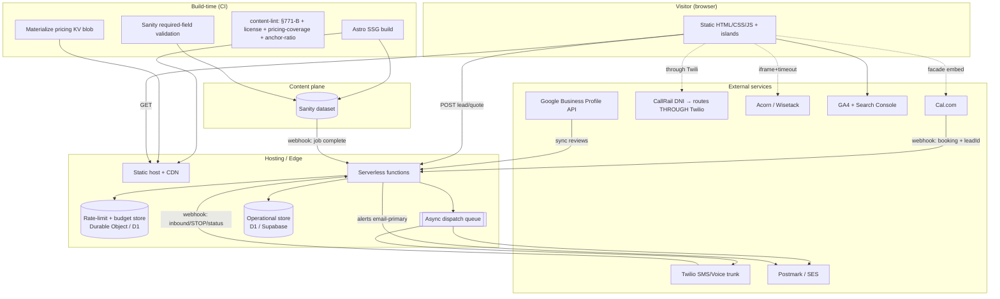

# Master Architecture Specification: Suffolk County Residential Roofing Website

**Version:** 2
**SOW Reference:** `SOW-suffolk-roofing.md`
**Research Reference:** `SYNTHESIS-suffolk-roofing.md`
**Review Reference:** `suffolk-roofing-synthesis-v1.md` (Cycle 1 — 6 reviews, 44 consolidated findings)
**Date:** 2026-08-02
**Status:** DRAFT (post-Cycle-1 revision; pending Cycle-2 re-review)

> **v1 → v2 changes** incorporate all APPROVED Cycle-1 findings (REV-001…REV-044, minus REV-040 deferred). Changed/added passages are tagged inline `[REV-xxx]`. See `suffolk-roofing-changelog.md` for the full audit trail.

---

## 0. Feature ID Registry

| ID | Feature | SOW Source |
|----|---------|-----------|
| F-001 | Astro static-first + Sanity headless CMS build (WordPress lean-theme fallback) | §2, §8 |
| F-002 | 12 deep town pages at flat `/areas/[town]/` | §2, §5 |
| F-003 | Town-page content-depth enforcement via required, non-swappable CMS schema fields | §4, §8 |
| F-004 | ~9 service pages | §2, §5 |
| F-005 | Core site pages | §2, §5 |
| F-006 | Internal-linking model + ≤30% exact-match anchors | §5 |
| F-007 | Structured-data / JSON-LD plan by page type | §2, §8 |
| F-008 | Booking — Cal.com free-tier embed | §6 |
| F-009 | Speed-to-lead automation (Twilio) | §6, §7 |
| F-010 | DNI call tracking (CallRail) | §6, §8 |
| F-011 | Financing prequal — third-party soft-pull | §6 |
| F-012 | 3-step lead form + TCPA consent | §6 |
| F-013 | Review-request tooling — ungated | §6, §7 |
| F-014 | Lead-capture quote widget — non-binding | §6, §7 |
| F-015 | Analytics — GA4 + Search Console + call tracking | §2 |
| F-016 | WCAG 2.2 AA + accessibility statement | §2, §7 |
| F-017 | 301 redirects + split XML sitemaps | §2, §8 |
| F-018 | Storm/emergency/leak cluster + LSA before Oct 2026 | §2, §10 |
| F-019 | License-number display + DCA verify link | §7, §8 |
| F-020 | Performance budget | §7, §8 |
| F-021 | Handoff documentation | §8 |
| F-022 | Editorial seed content + `/resources/` hub | §2, §5 |
| **F-023** | **Operator dashboard — lead + review-request + failed-send status (auth-gated)** `[REV-037]` | Spec-minted (supports F-009/F-013 operations) |

---

## 1. System Architecture Overview

### 1.1 Architecture Diagram

### 1.2 Technology Stack

Unchanged from v1 in choices (Astro + Sanity + host-native functions + Cal.com/Twilio/CallRail/Acorn/Postmark). Additions from Cycle 1:

| Concern | Decision | Source |
|---------|----------|--------|
| Rate-limit / budget state | **Shared** store — Cloudflare Durable Object (or D1-backed sliding-window counter), keyed by `cf-connecting-ip` **and** by normalized phone — never per-isolate memory | `[REV-001, REV-002]` |
| Async dispatch | **Cloudflare Queue** (or equivalent) for SMS/email sends, so `/api/lead` returns before any third-party call | `[REV-003, REV-014]` |
| Operational store | **Cloudflare D1** (primary) with timestamps stored as **integer Unix-epoch ms** (SQLite has no native `timestamptz`); Supabase Postgres if hosted on Netlify | `[REV-028]` |
| Pricing serving | Compact **pricing KV/JSON blob materialized at build + on each Sanity publish webhook**; `/api/quote` reads the edge cache, not the live content API | `[REV-031]` |
| Review source | **Google Business Profile API** import (external review ID + last-synced timestamp) backing `verifiedFeed` | `[REV-019]` |

### 1.3 Deployment Topology

Additions to v1:
- **Backup / DR** `[REV-005]`: nightly automated export of the operational store (D1 `export` → R2, or Supabase PITR), 30-day+ retention aligned to the TCPA statute of limitations; documented + tested restore runbook (part of F-021); a health check asserts the most-recent backup is <24h old. Nightly Sanity dataset export → R2 as well.
- **Migration safety** `[REV-021]`: every migration is classified `additive | rename | destructive`. Destructive/transformative migrations **require a pre-migration dataset export**, not a "re-run the prior migration" rollback claim.
- **Incremental build** `[REV-040 — DEFERRED]`: at launch (≤~20 pages) full SSG rebuild is fine; changed-page-only rebuild + cached link-graph is a Phase-3 scale task, logged in the backlog.
- **Alert channel independence** `[REV-032]`: all operator alerts route **primarily via Postmark/SES email**, independent of Twilio (so a Twilio outage alert doesn't depend on Twilio). Twilio SMS is a secondary channel only.

---

## 2. Content Model (Sanity Schema)

### 2.1 Content Relationship Diagram
*(unchanged from v1 — see town/service/townPricing/job/review/faq/post/siteSettings relationships)*

### 2.2 Sanity Document Types

Changes from v1:

#### `town` — F-002, F-003, F-019
- **Publish-gate now enumerates every SOW §4 sub-field and cardinality** `[REV-035]`: a document-level validation walks each required path — `buildingDept.{streetAddress,phone,counterHours,filingMethod,sourceUrl}`, `permit.{reroofRequired,feeCents,turnaroundBusinessDays,sourceUrl}` (with `sourceUrl` matching a `.gov`/eCode360 pattern), `historicOverlay`, `housingStock.{era,type,typicalRoofSquares}`, `localConditions.length≥1`, `namedStreets.length≥3`, `hamlets.length 2–4`, `landmarks.length 1–2`, `pricing` present, `taggedJobs.length≥3`, `faqs.length 10–13` — and surfaces the **exact missing path** in the Studio error and the CI content-integrity step.
- `townReviews` is **explicitly a soft warning, not a publish blocker** `[REV-044]` — a launch town with 0 reviews must be publishable (avoids blocking the October deadline). Confirmed excluded from the `Rule.required()` document-level gate.
- **Word count remains a soft warning** (SOW §4: density is the bar) `[DEC-A]` — the field-enumeration above is the real depth guarantee, not word count.
- `filingMethod`, `housingStock.type` etc. use constrained `options.list` enums `[REV-038]`.

#### `service` — F-004, F-018
- `intent`, `phase`, `urgentCluster` unchanged; `offersPrice` gates `Service.offers` schema.

#### `townPricing` — F-014, F-002
- **Money as integer cents** `[REV-009]`: `lowCents`, `highCents` (positive integers, validated `low ≤ high`) replacing `lowUsd/highUsd`; UI formats to dollars.
- `service` ref validated to point to an **active** `service` doc; `onDelete: restrict` so a referenced service can't be silently deleted `[REV-010]`.
- `effectiveYear` **required**, default current year; a build/runtime **staleness check** flags/excludes records older than N years `[REV-039]`.
- **Uniqueness:** exactly one record per `(town, service, homeSizeBand, effectiveYear)` — enforced in the materialized pricing blob build step and (if mirrored to the op-store) a DB UNIQUE index `[REV-008]`.

#### `job` — F-013
- **Adds customer-contact fields** `[REV-020]`: `customerName`, `customerPhone` (E.164), `customerEmail` — **required when `status = 'completed'`** (Studio validation), or the review-request can't send.
- **Adds `statusHistory`** (append-only transition log). The review-request fires **only on the first transition into `completed`** — a flip back-and-forth does not re-trigger `[REV-020, REV-015-source]`.
- `status` is a constrained enum `[REV-038]`.
- `job._id` (Sanity document id) is treated as **immutable** and is the stable key used by `review_request` (see §2.5) `[REV-010]`.

#### `review` — F-007
- `verifiedFeed` is **no longer an author-toggled boolean** `[REV-019]`. Reviews are imported via the **Google Business Profile API**; each stores `externalReviewId` + `lastSyncedAt`. `Review`/`AggregateRating` JSON-LD emits **only** where `externalReviewId` is present — a real sync state, not an assertion.

#### `post` — F-022, F-006
- Validation requires ≥1 in-body money-page link (unchanged).

#### `siteSettings` (singleton) — F-019, F-007
- Adds `tcpaConsentText` + `tcpaConsentVersion` (the versioned disclosure language rendered on forms and stored with each lead) `[REV-002, DEC-B]`.

**Portable-text safety (all body fields)** `[REV-007]`: raw-HTML block type is **disabled** in schema; the Astro renderer uses an **allowlist serializer** (strong/em/link/list only); a CSP header is set (see §7.3). A CI step scans rendered HTML for disallowed tags and fails the build on any match.

### 2.3 Content Validation & Publish Strategy
As v1, plus the enumerated field-path validation `[REV-035]` and migration classification `[REV-021]`.

### 2.4 Seed Data
As v1, plus `[REV-011]`: **before launch, a CI check enumerates the Cartesian product of launch towns × launch services × {small,medium,large}** and fails the build if any `townPricing` row is missing. Missing combos are seeded with provisional ranges (flagged `provisional=true`) so the quote widget returns a range with stronger disclaimer language instead of a 422 in production.

### 2.5 Operational Store (D1 primary / Supabase alt)

Timestamps are **integer epoch-ms** on D1 `[REV-028]`. All tables get explicit indexes `[REV-008]`.

#### `lead` — F-012, F-009
`id` (uuid PK), `client_idempotency_uuid` (unique — dedupes double-submits) `[REV-014]`, `created_at`, `zip`, `service`, `name`, `phone` (E.164, shared normalizer), `email`, `tcpa_consent` (bool), **`consent_text`, `consent_version`, `consent_timestamp`, `consent_ip`** `[REV-002, DEC-B]`, `source`, `speed_to_lead_sms_sent_at` (nullable), `advertising_status` (`active | informational_only`) `[REV-006]`, `status` (enum).
Indexes: `lead(created_at)`, `lead(phone)`, `lead(created_at, speed_to_lead_sms_sent_at)` (SLO scan), `UNIQUE(client_idempotency_uuid)`.

#### `message_log` — F-009, F-013
`id`, `lead_id` (FK→lead), `channel`, `template`, `provider_message_id`, `status` (enum: `queued|sent|delivered|failed|failed_permanent`), `twilio_error_code`, `retry_count`, `created_at`.
Index: `message_log(lead_id, status)`. Hard-bounce error codes → `failed_permanent`, no retry `[REV-024]`.

#### `review_request` — F-013
`id`, `job_id` (**immutable Sanity `_id`, `UNIQUE`**) `[REV-010]`, `customer_contact`, `status` (`pending|sent`), `requested_at`, `sent_at`, `responded` (bool).
The webhook inserts `status=pending` **only**; the cron/queue sends and flips to `sent` `[REV-003]`. `UNIQUE(job_id)` is the DB-level dedupe.

#### `opt_out` — F-009 (TCPA)
`phone` (E.164 PK), `opted_out_at`, `source`, `keyword_matched`, **`category`** (`transactional | review_request | all`) `[REV-002 / message-category]`. Every outbound send checks this first, in the same transaction as the send enqueue.

#### `webhook_events` (new) — REV-003
`idempotency_key` PK (`provider + event_id`; Twilio uses `MessageSid`, Sanity uses `_id+_rev`), `provider`, `received_at`, `processed_at`. Handlers `INSERT … ON CONFLICT DO NOTHING`; a duplicate returns 200 immediately.

#### `rate_state` (new / Durable Object) — REV-001
Backs per-IP and **per-phone** sliding-window limits and the **global daily SMS budget counter** with auto-disable + alert.

**PII retention** `[REV-013]`: a nightly purge anonymizes/deletes `lead` rows older than **24 months** (preserving aggregate analytics); consent records retained to the TCPA statute window; store encryption-at-rest enabled (platform default); an `operator_access_log` records dashboard reads of lead PII.

---

## 3. API & Function Design

### 3.1 Conventions
As v1, plus:
- **Rate limiting** `[REV-001, REV-002]`: enforced via the shared Durable Object / D1 counter (not per-isolate memory), keyed on `cf-connecting-ip`; **plus an independent per-phone limit** (≤1 speed-to-lead SMS per normalized phone / rolling 24h, checked against `lead`/`rate_state` before enqueue) so IP rotation can't bomb a target number; **plus a global daily SMS budget cap** that auto-disables sends and alerts the operator.
- **Server-side Turnstile verify** on `/api/lead` **and** `/api/quote` `[REV-001, REV-012]`: call siteverify with the secret, require `success` + hostname match + `challenge_ts` within 5 min, **fail-closed** on network error (no SMS). Turnstile script is **interaction-loaded** (on form focus) so it doesn't count against the initial-load LCP budget `[REV-015]`.
- **Accessible submit fallback** `[REV-027]`: if the Turnstile script is blocked/slow, the form still submits via a **no-SMS path** ("we'll email/call you") rather than locking out the user — reconciles the fail-closed stance with accessibility.

### 3.2 Endpoints

#### `POST /api/lead` — F-012, F-009
- Persists the lead and **returns 201 immediately**; the SMS is dispatched **asynchronously via the queue** `[REV-003, REV-014]` — a Twilio outage can never drop the lead. If the async send can't be enqueued, still return **202** with "received — we'll call you" and flag for manual follow-up `[REV-014, ADVOCATE-001]`.
- **Zod validation** `[REV-012]`: `zip` = 5-digit + Suffolk allowlist; `service`/`townSlug` = enum from the known set; `phone` = E.164 (shared normalizer); `tcpaConsent` = literal `true`; `client_idempotency_uuid` present. Stores `consent_text/version/timestamp/ip`.
- **East-End server gate** `[REV-006]`: resolve town by ZIP/slug; if `advertisingAllowed=false`, save the lead as `advertising_status=informational_only`, **do not** send a service-promise SMS, and return informational messaging — never a booking/serve promise in an unlicensed town.
- Per-phone + per-IP limits and Turnstile applied before enqueue.

#### `POST /api/quote` — F-014
- Reads the **materialized pricing blob** (edge cache), not the live API `[REV-031]`.
- Returns **400** (not 422) for an unknown/invalid town so the endpoint isn't a pricing-existence **oracle** `[REV-012]`; returns a real range for known town×service×band; for a known-but-unpriced combo returns a graceful "book an inspection" payload with the non-binding disclaimer preserved.
- Turnstile + rate limit applied (stops competitor scraping of the pricing matrix) `[REV-012]`.
- East-End server gate applied (informational estimate only) `[REV-006]`.
- Response includes `disclosure` (license #, `effectiveYear`, price factors, non-binding text) for the widget to render inline `[REV-030]`.

#### `POST /api/webhooks/calcom` — F-008, F-015
- **Idempotent** via `webhook_events` `[REV-003]`; verifies secret + timestamp skew.
- Matches the lead **deterministically by `leadId` passed as Cal.com metadata** (injected into the embed), not by fuzzy phone/email `[REV-017]`; marks `status=booked`; fires the GA4 `booking_completed` event **once, server-side**.

#### `POST /api/webhooks/twilio` (+ `/twilio-voice`) — F-009
- **Idempotent** via `webhook_events` (Twilio `MessageSid`) `[REV-003]`; Twilio signature + 5-min timestamp tolerance.
- **Full STOP set** `/^(stop|stopall|unsubscribe|cancel|end|quit)\b/i` (trim, case-insensitive), E.164-normalized before opt_out write; explicit `START` opt-back `[REV-002]`. On STOP, send **one** final TCPA-permitted confirmation SMS with the emergency phone number, bypassing suppression for that single message `[REV-026]`.
- Delivery `failed`: inspect `twilio_error_code` — retry only transient (30001-class); hard bounce (landline etc.) → `failed_permanent`, no retry, alert `[REV-024]`.
- **Voice path** `[REV-004]`: all inbound calls route through the Twilio number (the trunk); use Answering Machine Detection or a "press 1 to accept" whisper so an unaccepted call deterministically hits Twilio voicemail and fires the missed-call status → text-back. (See §5.3 for the CallRail routing constraint that makes this hold.)

#### `POST /api/webhooks/sanity-job` — F-013
- **Idempotent** via `webhook_events`; verifies the Sanity `_id` still exists and `status` is still `completed` before acting `[REV-010]`.
- **Inserts `review_request(status=pending)` only** — no send in the webhook `[REV-003]`. `UNIQUE(job_id)` prevents a duplicate row.

#### Scheduled functions
- `cron: review-sweep` (hourly) — sends any `review_request(status=pending)`, flips to `sent` `[REV-003]`.
- **`cron: slo-sweep` (every 1–2 min)** `[REV-022]` — scans `lead` for `speed_to_lead_sms_sent_at IS NULL` older than the SLO window **regardless of whether a `message_log` row exists** (catches crash-before-send); retries the send, alerts the operator (email-primary), and emails the user a "we have your info, we'll call you" recovery message.
- `cron: pii-purge` (nightly) — retention enforcement `[REV-013]`.

### 3.3 Webhook Verification & Idempotency Summary
All inbound webhooks: signature/secret verify **+ timestamp tolerance + `webhook_events` dedupe** `[REV-003]`. Duplicate → 200 no-op.

---

## 4. Component & Page Architecture

Changes from v1:

- **Sticky call button** renders a **canonical `tel:` in static HTML**; CallRail swaps text/href after load — works instantly even if CallRail is blocked `[REV-018]`.
- **Third-party embeds** (Cal.com, financing) use a **facade / IntersectionObserver** pattern (load on scroll/click), CallRail + GA4 + Turnstile deferred/interaction-loaded, all counted in the F-020 budget (now **4–5** scripts) and enforced in CI `[REV-015]`.
- **Islands hidden on East-End** `[REV-006]`: `LeadForm`, `QuoteWidget`, `BookingEmbed` are all suppressed/replaced with an informational "not yet licensed in this town" message when `advertisingAllowed=false` — not just the ServiceGrid CTA.
- **QuoteWidget** `[REV-016, REV-030]`: result container is `aria-live="polite"` `aria-atomic="true"`; renders license badge + `effectiveYear` + factors + non-binding disclaimer inline; three explicit states (loading skeleton / success / unavailable-CTA); **never renders a numeric range not from the API response**.
- **LeadForm** `[REV-014, REV-016]`: submit disabled + spinner on click; `client_idempotency_uuid` in payload; inline network-error with fallback phone; 3-step inputs persisted in `sessionStorage` (survive back-nav); `aria-live` on errors, focus moves to first invalid field.
- **Transparency surfacing** `[REV-030]`: compact license/verify badge in the header/sticky mobile nav; a "Trust & Compliance" block near the top of `/contact/` (license #, insurance, DCA verify link) — not only the footer.
- **`/resources/index.astro`** fully specified `[REV-034]`: Sanity query (posts by `publishedAt` desc, paginated 10/page) + `PostList` component.
- **Financing / Cal.com embeds** get a load **timeout + `onError`** fallback to a phone CTA `[REV-025]`.

### 4.4 Routing & Internal Linking
As v1 (anchor-ratio ≤30% CI gate, adjacency-only town links, orphan check), plus the **server-side** East-End enforcement above so the legal gate holds even against a direct API post `[REV-006]`.

---

## 5. Integration Requirements

- **5.1 Cal.com** — **Verify free-tier webhook support as a Phase-0 gate** `[REV-023]` (booking→GA4 is on the SOW §7 critical path); if webhooks are paid-only, budget an upgrade or an API-polling fallback. Pass `leadId` metadata into the embed `[REV-017]`. Facade-load + timeout fallback `[REV-015, REV-025]`.
- **5.2 Twilio** — is the **central voice trunk**; AMD/whisper for deterministic missed-call detection `[REV-004]`; error-code-aware retries `[REV-024]`; full STOP handling `[REV-002]`.
- **5.3 CallRail** — **destination numbers route to the Twilio number, never directly to a cell** `[REV-004]`, so tracked calls still fire the Twilio missed-call webhook. DNI-swap **failure fires a GA4 beacon** so attribution decay is visible `[REV-043]`. Canonical NAP stays fixed in HTML/JSON-LD.
- **5.4 Acorn/Wisetack** — iframe with **timeout + `onError`** → phone-CTA fallback; never pass PII in the iframe src `[REV-025]`.
- **5.5 Postmark/SES** — **primary alert channel** (Twilio-independent) `[REV-032]`; review-request + operator notifications + user SLO-recovery emails.
- **5.6 GA4 + Search Console** — booking event fires server-side, once `[REV-003]`.
- **5.7 Google Business Profile API** (new) — periodic authenticated review import backing `verifiedFeed` `[REV-019]`.
- **5.8 Google LSA** — Phase-0 enrollment task, 2–5 wk lead time (unchanged).

---

## 6. Build Phases
Phase order unchanged (Phase 0 foundations → Phase 1 storm cluster before October → Phase 2 depth → Phase 3 scale → Phase 4 review). Phase-0 additions from Cycle 1:
- Verify Cal.com free-tier webhooks `[REV-023]`.
- Stand up the operational store **with backups + restore drill** before it holds real leads `[REV-005]`.
- Pricing-coverage CI check green before launch `[REV-011]`.

F-021 handoff docs remain a per-phase deliverable, now with a **concrete acceptance checklist** `[REV-042]`: architecture diagram current; `.env.example` complete; "how to add a town" runbook dry-run by someone other than Adam; deploy/rollback exercised once; secrets-rotation documented; restore drill performed.

---

## 7. Security, Privacy & Compliance

Additions from Cycle 1:
- **7.3 CSP + sanitization** `[REV-007]`: `Content-Security-Policy` (`script-src 'self' *.cal.com *.callrail.com googletagmanager.com; object-src 'none'; base-uri 'self'`), allowlist portable-text serializer, raw-HTML blocked in schema.
- **7.3 PII** `[REV-013]`: retention/purge (24 mo), encryption-at-rest, `operator_access_log`; full **versioned consent text** stored per lead `[DEC-B]`.
- **7.1 Operator dashboard (F-023)** defaults to **Sanity SSO**; basic-auth only as a stopgap paired with an IP allowlist `[REV-013]`.
- **7.5 §771-B content lint** `[REV-029]`: `/scripts/content-lint.ts` with concrete banned-phrase regexes (`waive.*deductible`, `no.*deposit.*required`, `we.*handle.*insurance.*claim`, `adjust.*claim`, …) scanning Sanity body + siteSettings at build; fails the build on match. Legal-review checklist in the PR template.
- **East-End gate is server-enforced** on `/api/lead` + `/api/quote`, not render-only `[REV-006]`.

---

## 8. Error Handling & Observability

Additions:
- **8.3 Speed-to-lead SLO** `[REV-022]`: driven by `cron: slo-sweep` (1–2 min), null-safe (treats "never attempted" == "failed"); emits latency histogram + success/failure counters to a metrics sink with one dashboard panel (p50/p95, failure rate); breach → operator alert **and** user recovery email.
- **8.3 Cost/TCPA observability** `[REV-036]`: `sms_cost_daily`, `opt_out_rate`, `consent_stored_total`; alert on spend threshold; append-only consent audit.
- **8.1 Failed-send compensation** `[REV-033]`: after max retries (1/5/15 min schedule), high-priority email with a one-click **resend deep link** into the F-023 dashboard; failed leads surface in a dedicated queue view.
- **8.3 Alert channel independence** `[REV-032]`; **CallRail DNI-failure beacon** `[REV-043]`.
- **8.x Backup health check** `[REV-005]`: asserts newest backup <24h.

---

## 9. Testing Strategy

v1 tests retained; new/expanded E2E and unit coverage from Cycle 1:

| New/updated test | Feature | Source |
|------------------|---------|--------|
| Per-phone throttle: rotate source IPs with same target phone → only 1 SMS fires | F-009 | REV-001 |
| STOP with **non-canonical phone format** → opt_out matches end-to-end (E.164 normalization) | F-009 | REV-002 |
| Webhook **replay** (duplicate event id) → no duplicate SMS/review/GA4 | F-008/009/013 | REV-003 |
| Missed-call via AMD/whisper → text-back fires; call routed to cell → still trunks through Twilio | F-009/010 | REV-004 |
| East-End: direct `POST /api/lead` + `/api/quote` for a gated town → `informational_only`, no service SMS; LeadForm/QuoteWidget/BookingEmbed absent on page | F-002 | REV-006 |
| Portable text with `<script>` → sanitized/blocked; CSP header present | F-003 | REV-007 |
| Quote: unknown town → **400** (not 422 oracle); unpriced combo → book-CTA payload with disclaimer; range only from API | F-014 | REV-011/012 |
| Cal.com booking with `leadId` metadata → deterministic lead match + single GA4 event | F-008 | REV-017 |
| Sticky call button works with CallRail script blocked | F-010 | REV-018 |
| Review-request: webhook writes `pending` only; crash after insert → cron sends exactly once (no double) | F-013 | REV-003 |
| Restore drill: operational store restored from backup in a preview env | F-021 | REV-005 |
| a11y: QuoteWidget/LeadForm `aria-live` announced; focus not obscured; 3-step state survives back-nav | F-016 | REV-016 |

F-021 acceptance is now the concrete checklist in §6 `[REV-042]`.

---

## 10. Feature-to-Component Traceability Matrix

All v1 mappings retained; deltas:

| Feature | Change in v2 |
|---------|--------------|
| F-009 | + per-phone limiter, async queue, full STOP/E.164, slo-sweep cron, error-code retries, backup of opt-out evidence |
| F-013 | + job customer-contact fields, first-transition guard, invert-to-pending, `UNIQUE(job_id)`, GBP review import |
| F-014 | + integer cents, pricing-coverage CI, materialized blob, 400-not-oracle, inline legal disclosure |
| F-002/F-003 | + full field-path publish gate, portable-text sanitization, soft word-count + soft townReviews |
| F-006 | + server-side East-End enforcement |
| F-016 | + ARIA live/focus/state-preservation in islands |
| F-019 | + header/contact transparency surfacing |
| F-020 | + captcha counted (4–5 scripts), facade loading |
| F-021 | + concrete handoff checklist + restore drill |
| **F-023** | **NEW** — operator dashboard: op-store tables (§2.5), auth (§7.1), failed-send queue (§8.1); Test: E2E auth + resend |

All 23 features trace to concrete components, data, functions, tests, and a build phase.

---

## 11. Decisions Recorded (Cycle 1)

- **DEC-A — Word count:** kept **soft** (SOW-faithful; density enforced via field enumeration REV-035).
- **DEC-B — Consent:** store **full versioned consent text** (audit-defense value > minimal PII).
- **REV-040 — Incremental builds:** **DEFERRED** to Phase 3 (backlog).

---

*Spec v2 folds in all approved Cycle-1 findings. Because 7 CRITICAL fixes were incorporated (rate-limit architecture, TCPA consent/STOP, webhook idempotency, voice routing, op-store DR, East-End server gate, portable-text XSS), a Cycle-2 re-review is scheduled to verify the fixes before lock.*
